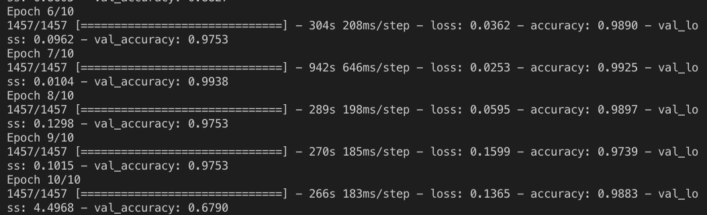

# Automatic Optical Inspection

This repository is a demonstration of computer vision as a quality assurance asset, utilizing Keras to generate the Convolutional Neural Network.

- **Results**: 95% accuracy, splitting the data 90%:10% for training:testing respectively.
- **Application:** This technology provides a meaningful way of categorizing defects, which may be used in combination with other analysis to determing the defect cause. 

## Dataset

_North Eastern Univeristy (NEU) Surface Defect Database_. The database is difficult to track down, but [this link](https://github.com/abin24/Surface-Inspection-defect-detection-dataset) provides a way to access it.

Each image is labelled with the first two characters specifying it's defect type, which may be decoded using the table below.

| label | Defect Type |  
| --- | --- |  
| Cr | Crazing |
| In | Inclusion |
| Pa | Patches |
| PS | Pitted Surface |
| RS | Rolled-in Scale |
| Sc | Scratches |

### Dataset Examples: 


[Source: NEU](http://faculty.neu.edu.cn/yunhyan/NEU_surface_defect_database.html)


## Usage

In terminal, run  

```
git clone https://github.com/LutzerD/AOI  
cd AOI
python3 main.py 
```  

Although you will have to install relevant, missing packages with pip3.

## Notes on Application

**Model:** MobileNet with 2 Dense layers and 1 GlobalAveragePooling2D layer.


__Beware of overfitting__

7 Epochs was chosen since this seems to be the turning point before over-fitting the model. See the training over 10 epochs below, which regresses to 70% accuracy at 10 epochs.




## Legal Disclaimer

The image datasets are  used only for academic research, no commercial purposes are allowed.

